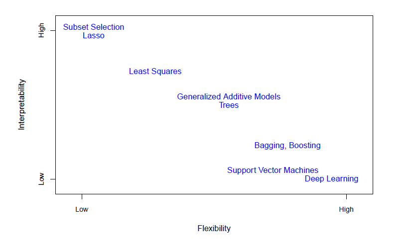
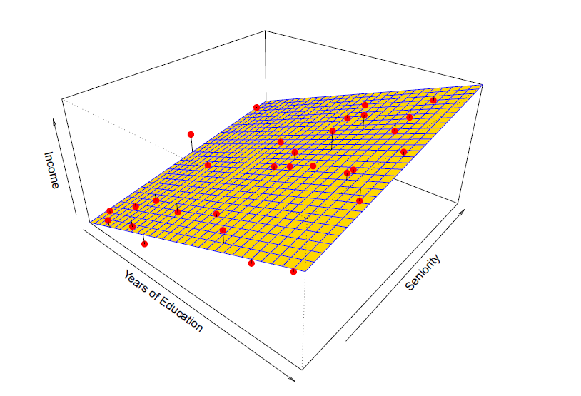
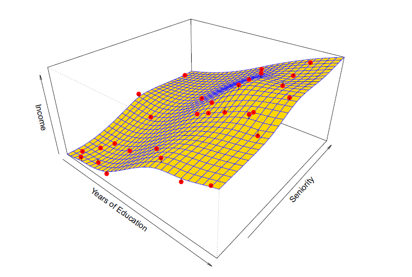

## ISL: Chapter 01
- Three types of problems:
  - Regression 
    - Quantative value: A person's salary
  - Classification
    - Qualitative value: Whether a person survives or not
  - Clustering

### Book Notation:
- Xij (i is the rows or observations, n = number of rows or observations or data points, j is the columns or properties,  p = number of columns or properties)
- xi is a vector of length p
- xj is a vector of length n
- xj1 contains the n=3000 observations for the value of year
- xi1 contains the 11 properties of a person
- yi response variable for the ith observation

### Linear methods vs non-linear competitors
- Interpretability
  - Better for ingerence where you want to know the relationship between X and Y
- Accuracy sometimes

### Types of Linear methods
- has quantative response
- Linear Regression
  - relatively inflexible
  - can only generate linear functions
- Stepwise Selection
- Ridge Regression
- principal Components Regression
- Lasso

### Types of Classification Methods
- Has qualitative response
- Logistic Regression
- Linear Discriminat Analysis

Y axis (or Xj (X1 is radio budget, X2 is newspaper budget, etc.)):
- Predictors
- properties
- Features
- Independent Variables
- Variables

Result:
- Response
- Dependent Variable

### Prediction vs Inference
- **Prediction:** Set of X inputs is readily available, and we want to find Y. Y = f(x). We are trying to estimate f, the function, so we can predict Y.
  - f will not be a perfect estimate for f
  - reducible error: improve the accuracy of f
  - irreducible error: Y is also a function of ε
  - Examples
    - Is this house under- or over-valued? Predicting the value of a home
- **Inference:** Understanding the association between Y and X, and understand the function.
  - Which predictors are associates with the response? Which X values and relevant to producing Y
  - What is the relationship between the response and each predictor?
    - Which media are associated with sales?
    – Which media generate the biggest boost in sales? or
    – How large of an increase in sales is associated with a given increase
    in TV advertising?
    - How much extra will a house be worth if it has a view of the river?

### Parametric vs Non-Parametric Methods

- Parametric
  - 
  - Better for prediction because it doesn't closely fit the data, but possibly predicts better
  - Uses a pre-specified model
  - Better for inference because it's an easy to understand relationship
- Non-Parametric
  - 
  - A level of smoothness (or flatness) must be selected by the data analysi
  

Many methods are less flexible, and can only produce a small range of shapes to estimate f.

### Supervised vs Unsupervised Learning
Example: Market Segmentation study, we observe multiple characterists for potential customers, such as zip code, family income, and shopping habits. We believe the customers fall into different groups such as big spenders vs low spenders.

- Supervised: If response, ie: each customer's spend is available then a supervised analysis is possible.
- Unsupervised: Seeking to understand the relationship between variables oor between observations since we lack a response or result to predict. AKA clustering
Automated clustering is required because we cannot visually cluster as the amount of variables grow.
Number of scatterplots produced corresponding to the number of variables:
- varA varB = 1 graph
- varA varB varC = 3 graphs (AxB, AxC, BxC)
- varA varB varC varD = 6 graphs (AxB, AxC, AxD, BxC, BxD, CxD)
- varA varB varC varD varE = 10 graphs

